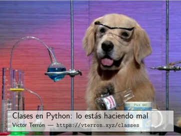

The slides of the talk I gave at [PyConES 2014](http://2014.es.pycon.org/) (Zaragoza, Spain).

[][pdf]

They are also [available as a PDF][pdf], always up-to-date via [a GitHub action](../.github/workflows/python-classes.yml).

- Title: *Classes in Python: You're Doing it Wrong*
- Language: Spanish
- License: [CC BY-SA 4.0](http://creativecommons.org/licenses/by-sa/4.0/)

[pdf]: https://static.vterron.xyz/python-classes.pdf
