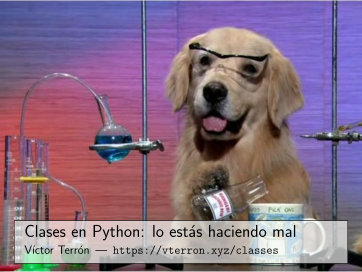

The slides, in Spanish, of the talk I gave at `PyCon ES 2014 <http://2014.es.pycon.org/>`_ (Zaragoza, Spain).

|PDF|_

They are also `available as a PDF`__, always up-to-date (via git hooks).

* Title: *Classes in Python: You're Doing it Wrong*
* Language: Spanish
* License: `CC BY-SA 4.0 <http://creativecommons.org/licenses/by-sa/4.0/>`_

.. _PDF: http://www.iaa.es/~vterron/python-clases.pdf
__ PDF_
