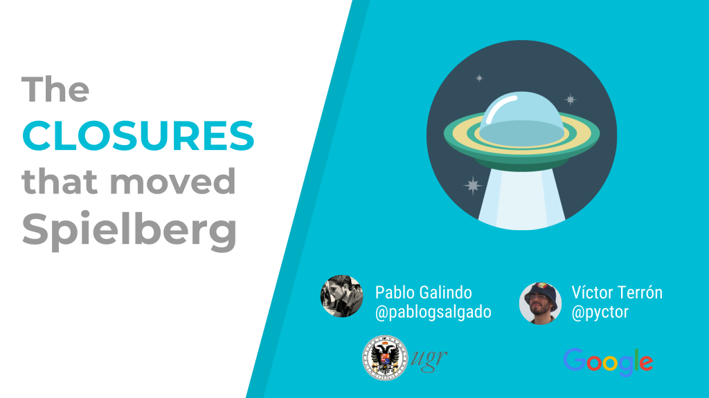

The slides of the talk I gave with [Pablo Galindo](https://twitter.com/pyblogsal) at [PyConES 2016](http://2016.es.pycon.org/) (Almería, Spain).

- **Title**: *The closures that moved Spielberg*
- **Language**: English
- **License**: [CC BY-SA 4.0](http://creativecommons.org/licenses/by-sa/4.0/)
