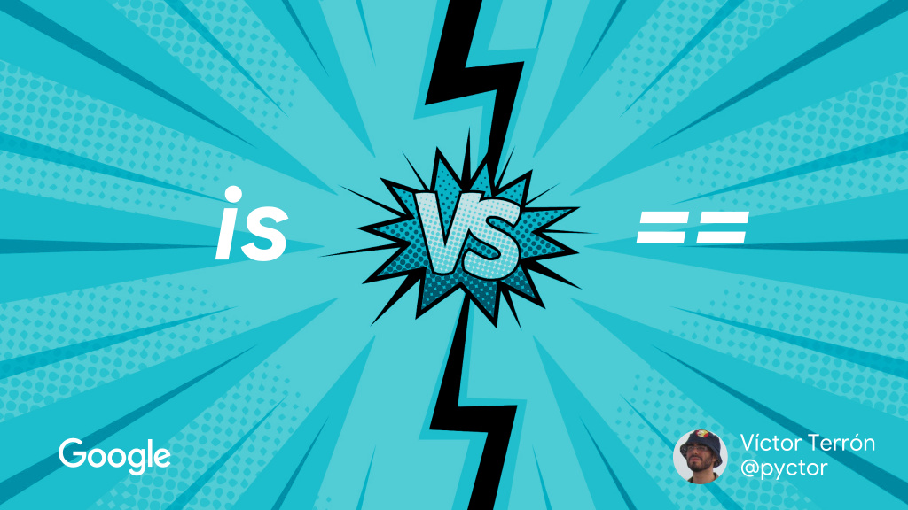

The Jupyter notebook of my lighting talk at [PyConES 2018](https://2018.es.pycon.org/) (Málaga, Spain). You can [view it online with nbviewer][nbviewer].

[][nbviewer]

- **Title**: *`is` versus `==`*
- **Language**: English
- **License**: [CC BY-SA 4.0](http://creativecommons.org/licenses/by-sa/4.0/)

[nbviewer]: http://nbviewer.jupyter.org/github/vterron/python-talks/blob/master/%5B2018%5D%20'is'%20versus%20%3D%3D%20%5Blightning%5D/is-versus-equals.ipynb
