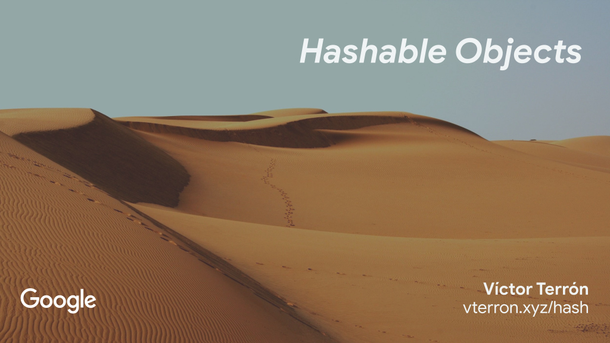

**URL:** [vterron.xyz/hash](http://vterron.xyz/hash)

The Jupyter notebook of my talk on hashable objects.

There are two versions of the slides:

- The original, [director's cut](https://en.wikipedia.org/wiki/Director's_cut) version (~1:30h).
  * I presented this at [PyDay Tenerife 2018](https://pythoncanarias.es/events/pydaytf18/) (Tenerife, Spain).
  * You can view these online [with nbviewer][nbviewer].
  * Talk recording on YouTube is available [here](https://www.youtube.com/watch?v=aU7MEtgdHw0).
  * To generate these slides, just run `make`.
- The abridged version (~40m).
  * I presented this at [PyConES 2019](https://2019.es.pycon.org/) (Alicante, Spain).
  * To generate these slides, run `make abridged`.

[][nbviewer]

- **Title**: *Hashable Objects*
- **Language**: English
- **License**: [CC BY-SA 4.0](http://creativecommons.org/licenses/by-sa/4.0/)

[nbviewer]: http://nbviewer.jupyter.org/github/vterron/python-talks/blob/master/%5B2018%5D%20Hashable%20Objects/python-hashable.ipynb
