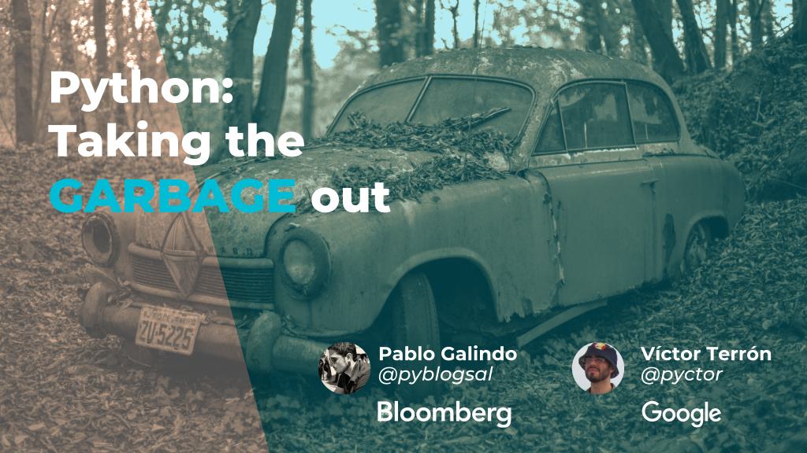

The slides of the talk I gave with [Pablo Galindo](https://twitter.com/pyblogsal) at [PyConES 2018](https://2018.es.pycon.org/) (Málaga, Spain).

- **Title**: *Python: Taking the Garbage Out*
- **Language**: English
- **License**: [CC BY-SA 4.0](http://creativecommons.org/licenses/by-sa/4.0/)

